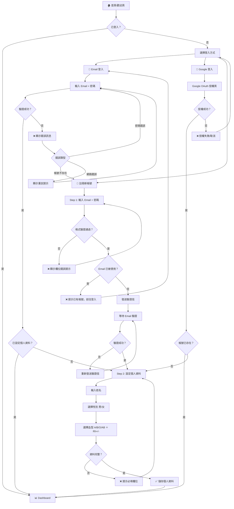
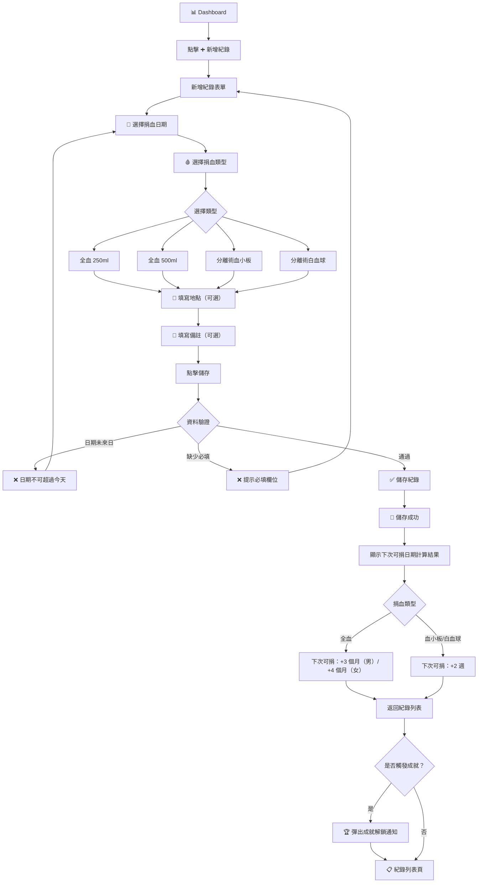
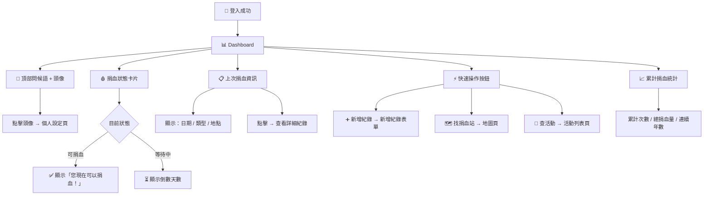
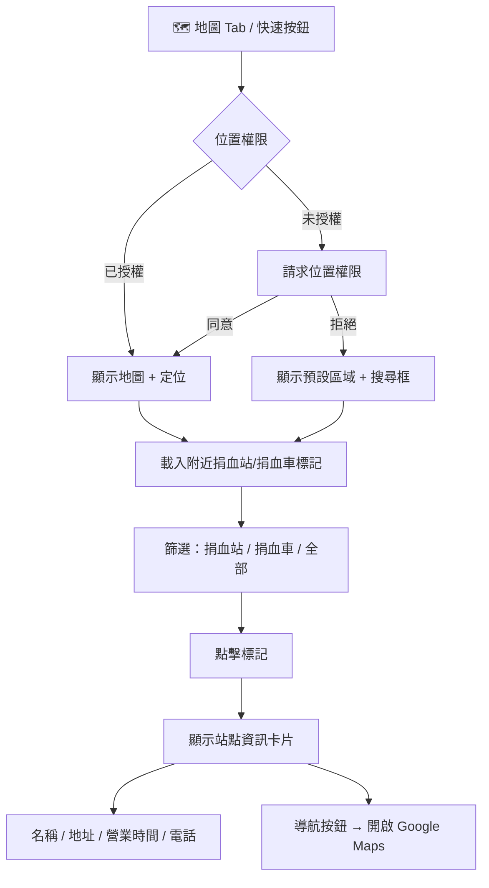

# User Flows — 捐血勇士 (Blood Hero)

## 1. 註冊/登入流程

```mermaid
flowchart TD
    A[🏠 首頁/歡迎頁] --> B{已登入？}
    B -->|是| Z[📊 Dashboard]
    B -->|否| C[選擇登入方式]

    C --> D[📧 Email 登入]
    C --> E[🔵 Google 登入]
    C --> F[📝 註冊新帳號]

    %% Email 登入
    D --> D1[輸入 Email + 密碼]
    D1 --> D2{驗證成功？}
    D2 -->|是| D3{已設定個人資料？}
    D2 -->|否| D4[❌ 顯示錯誤訊息]
    D4 --> D5{錯誤類型}
    D5 -->|帳號不存在| F
    D5 -->|密碼錯誤| D1
    D5 -->|網路錯誤| D6[顯示重試提示]
    D6 --> D1
    D3 -->|是| Z
    D3 -->|否| P1

    %% Google 登入
    E --> E1[Google OAuth 授權頁]
    E1 --> E2{授權成功？}
    E2 -->|是| E3{帳號已存在？}
    E2 -->|否| E4[❌ 授權失敗/取消]
    E4 --> C
    E3 -->|是| Z
    E3 -->|否| P1

    %% 註冊
    F --> F1[Step 1: 輸入 Email + 密碼]
    F1 --> F2{格式驗證通過？}
    F2 -->|否| F3[❌ 顯示欄位錯誤提示]
    F3 --> F1
    F2 -->|是| F4{Email 已被使用？}
    F4 -->|是| F5[❌ 提示已有帳號，前往登入]
    F5 --> D
    F4 -->|否| F6[發送驗證信]
    F6 --> F7[等待 Email 驗證]
    F7 --> F8{驗證成功？}
    F8 -->|否| F9[重新發送驗證信]
    F9 --> F7
    F8 -->|是| P1

    %% 個人資料設定
    P1[Step 2: 設定個人資料] --> P2[輸入姓名]
    P2 --> P3[選擇性別 男/女]
    P3 --> P4[選擇血型 A/B/O/AB ＋ Rh+/-]
    P4 --> P5{資料完整？}
    P5 -->|否| P6[❌ 提示必填欄位]
    P6 --> P1
    P5 -->|是| P7[✅ 儲存個人資料]
    P7 --> Z
```

## 2. 新增捐血紀錄流程

```mermaid
flowchart TD
    A[📊 Dashboard] --> B["點擊 ➕ 新增紀錄"]
    B --> C[新增紀錄表單]

    C --> D[📅 選擇捐血日期]
    D --> E[🩸 選擇捐血類型]

    E --> E1{"選擇類型"}
    E1 --> E1a[全血 250ml]
    E1 --> E1b[全血 500ml]
    E1 --> E1c[分離術血小板]
    E1 --> E1d[分離術白血球]

    E1a & E1b & E1c & E1d --> F["📍 填寫地點（可選）"]
    F --> G["📝 填寫備註（可選）"]
    G --> H[點擊儲存]

    H --> I{資料驗證}
    I -->|日期未來日| J[❌ 日期不可超過今天]
    J --> D
    I -->|缺少必填| K[❌ 提示必填欄位]
    K --> C
    I -->|通過| L[✅ 儲存紀錄]

    L --> M[🎉 儲存成功]
    M --> N[顯示下次可捐日期計算結果]
    N --> N1{捐血類型}
    N1 -->|全血| N2["下次可捐：+3 個月（男）/ +4 個月（女）"]
    N1 -->|血小板/白血球| N3["下次可捐：+2 週"]
    N2 & N3 --> O[返回紀錄列表]

    O --> P{是否觸發成就？}
    P -->|是| Q[🏆 彈出成就解鎖通知]
    Q --> R[📋 紀錄列表頁]
    P -->|否| R
```

## 3. Dashboard 瀏覽流程

```mermaid
flowchart TD
    A[🔐 登入成功] --> B[📊 Dashboard]

    B --> C1[👤 頂部問候語 + 頭像]
    B --> C2[🩸 捐血狀態卡片]
    B --> C3[📋 上次捐血資訊]
    B --> C4[⚡ 快速操作按鈕]
    B --> C5[📈 累計捐血統計]

    C1 --> C1a["點擊頭像 → 個人設定頁"]

    C2 --> C2a{目前狀態}
    C2a -->|可捐血| C2b["✅ 顯示「您現在可以捐血！」"]
    C2a -->|等待中| C2c["⏳ 顯示倒數天數"]

    C3 --> C3a["顯示：日期 / 類型 / 地點"]
    C3 --> C3b["點擊 → 查看詳細紀錄"]

    C4 --> C4a["➕ 新增紀錄 → 新增紀錄表單"]
    C4 --> C4b["🗺 找捐血站 → 地圖頁"]
    C4 --> C4c["📅 查活動 → 活動列表頁"]

    C5 --> C5a["累計次數 / 總捐血量 / 連續年數"]
```

## 4. 地圖找捐血站流程

```mermaid
flowchart TD
    A["🗺 地圖 Tab / 快速按鈕"] --> B{位置權限}
    B -->|已授權| C[顯示地圖 + 定位]
    B -->|未授權| D[請求位置權限]
    D -->|同意| C
    D -->|拒絕| E[顯示預設區域 + 搜尋框]

    C --> F[載入附近捐血站/捐血車標記]
    E --> F

    F --> G["篩選：捐血站 / 捐血車 / 全部"]
    G --> H[點擊標記]
    H --> I[顯示站點資訊卡片]
    I --> I1["名稱 / 地址 / 營業時間 / 電話"]
    I --> I2["導航按鈕 → 開啟 Google Maps"]
```
